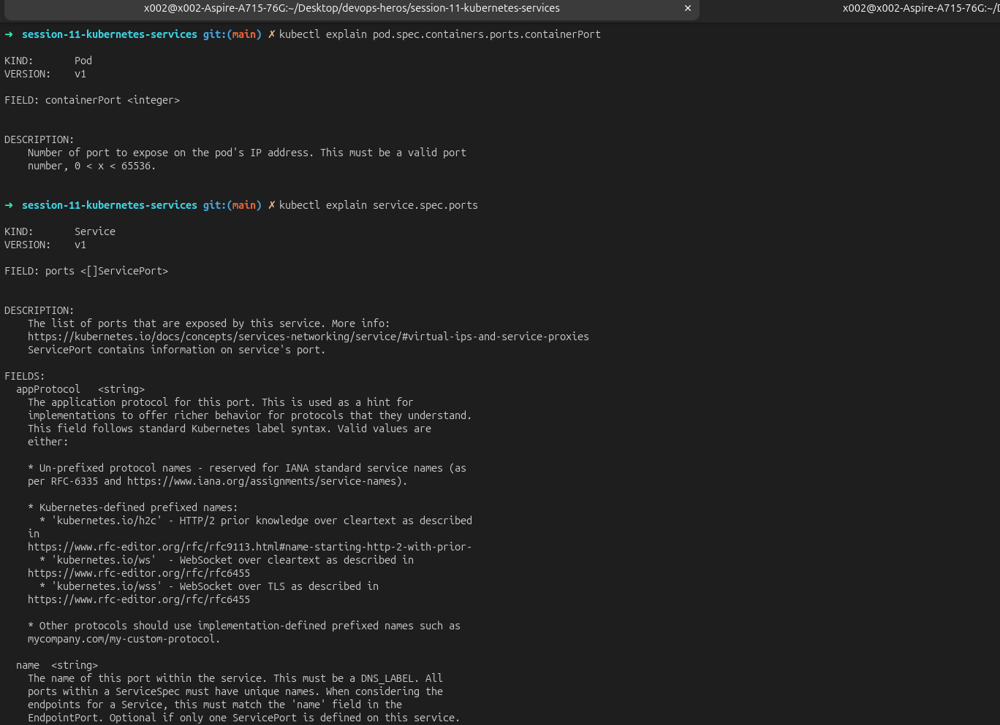
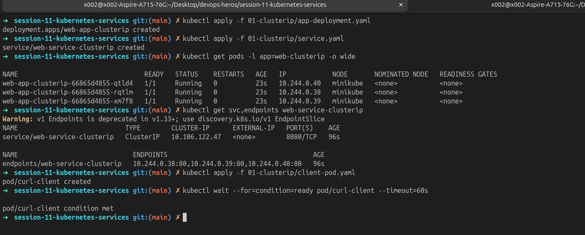
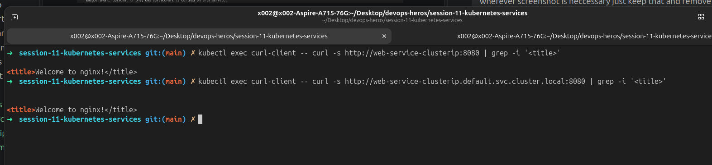
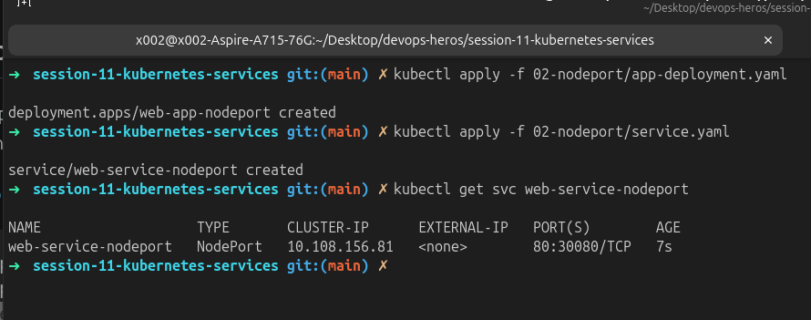
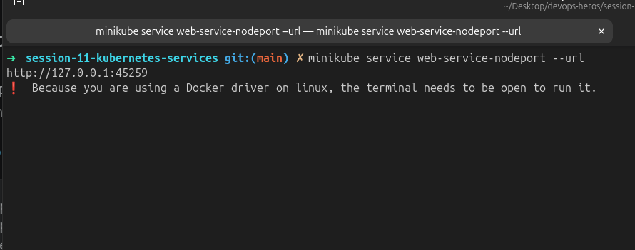
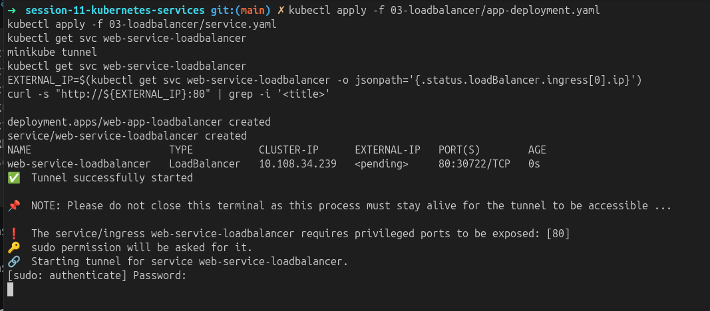
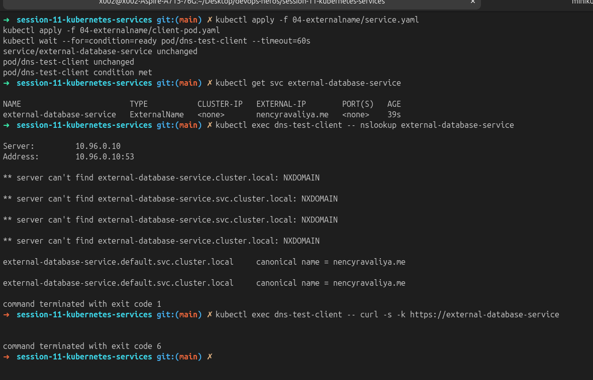
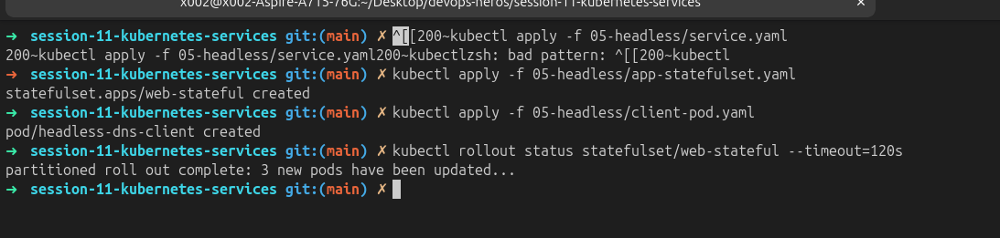
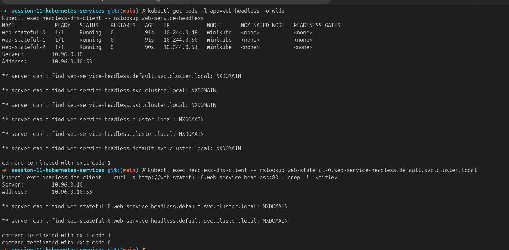

# Lecture 11: Kubernetes Services, DNS, and Workload Identity

> Practical lab record for Services, CoreDNS, StatefulSets, workload controllers, and Minikube networking.

This README is the submission index for the tasks assigned across Lectures 11-13. Detailed explanations and manifests remain in the individual lab folders; this page collects the workflow, evidence checklist, architecture notes, and submitted screenshots in one place.

## Contents

1. [Port architecture](#1-port-architecture)
2. [ClusterIP](#2-clusterip)
3. [NodePort](#3-nodeport)
4. [LoadBalancer](#4-loadbalancer)
5. [ExternalName](#5-externalname)
6. [Headless Service](#6-headless-service)
7. [Services without selectors](#7-services-without-selectors)
8. [FQDN and CoreDNS](#8-fqdn-and-coredns)
9. [Deployment versus StatefulSet identity](#9-deployment-versus-statefulset-identity)
10. [Controller comparison](#10-controller-comparison)
11. [Service selection and cost](#11-service-selection-and-cost)
12. [Minikube Docker-driver networking](#12-minikube-docker-driver-networking)

## 1. Port Architecture

Kubernetes uses four related but distinct port fields:

```text
External client
     |
     v
Node IP:<nodePort 30080>
     |
     v
Service virtual IP:<port 80>
     |
     v
Pod:<targetPort 80>
     |
     v
Container process:<containerPort 80>
```

| Field | Scope | Example |
| --- | --- | --- |
| `nodePort` | Port opened on every worker node | `30080` |
| `port` | Port exposed by the Service | `80` |
| `targetPort` | Pod port selected by the Service | `80` |
| `containerPort` | Container metadata describing the listening port | `80` |

```bash
kubectl explain pod.spec.containers.ports.containerPort
kubectl explain service.spec.ports
```



## 2. ClusterIP

The default internal Service type gives a stable virtual IP and DNS name for matching Pods. The lab uses three Nginx replicas, Service port `8080`, and Pod `targetPort` `80`.

See [01-clusterip/README.md](01-clusterip/README.md), [app-deployment.yaml](01-clusterip/app-deployment.yaml), and [service.yaml](01-clusterip/service.yaml).

```bash
kubectl apply -f 01-clusterip/app-deployment.yaml
kubectl apply -f 01-clusterip/service.yaml
kubectl get pods -l app=web-clusterip -o wide
kubectl get svc,endpoints web-service-clusterip
kubectl apply -f 01-clusterip/client-pod.yaml
kubectl wait --for=condition=ready pod/curl-client --timeout=60s
kubectl exec curl-client -- curl -s http://web-service-clusterip:8080 | grep -i '<title>'
kubectl exec curl-client -- curl -s http://web-service-clusterip.default.svc.cluster.local:8080 | grep -i '<title>'
```





## 3. NodePort

`NodePort` exposes a high port on every node and creates a ClusterIP underneath. This lab fixes the NodePort at `30080`.

See [02-nodeport/README.md](02-nodeport/README.md), [app-deployment.yaml](02-nodeport/app-deployment.yaml), and [service.yaml](02-nodeport/service.yaml).

```bash
kubectl apply -f 02-nodeport/app-deployment.yaml
kubectl apply -f 02-nodeport/service.yaml
kubectl get svc web-service-nodeport
curl -I "http://$(minikube ip):30080"
minikube service web-service-nodeport --url
```





## 4. LoadBalancer

In a cloud, `LoadBalancer` requests an external provider load balancer. Minikube simulates this behavior with `minikube tunnel`; the Service still receives an internal ClusterIP and NodePort.

See [03-loadbalancer/README.md](03-loadbalancer/README.md), [app-deployment.yaml](03-loadbalancer/app-deployment.yaml), and [service.yaml](03-loadbalancer/service.yaml).

```bash
kubectl apply -f 03-loadbalancer/app-deployment.yaml
kubectl apply -f 03-loadbalancer/service.yaml
kubectl get svc web-service-loadbalancer
minikube tunnel
kubectl get svc web-service-loadbalancer
EXTERNAL_IP=$(kubectl get svc web-service-loadbalancer -o jsonpath='{.status.loadBalancer.ingress[0].ip}')
curl -s "http://${EXTERNAL_IP}:80" | grep -i '<title>'
```




## 5. ExternalName

`ExternalName` creates a CoreDNS CNAME alias. It has no selector, endpoints, or ClusterIP; the client resolves the external hostname and connects directly to it.

See [04-externalname/README.md](04-externalname/README.md), [service.yaml](04-externalname/service.yaml), and [client-pod.yaml](04-externalname/client-pod.yaml).

```bash
kubectl apply -f 04-externalname/service.yaml
kubectl apply -f 04-externalname/client-pod.yaml
kubectl wait --for=condition=ready pod/dns-test-client --timeout=60s
kubectl get svc external-database-service
kubectl exec dns-test-client -- nslookup external-database-service
kubectl exec dns-test-client -- curl -s -k https://external-database-service
```



## 6. Headless Service

Setting `clusterIP: None` removes the virtual IP. CoreDNS returns the individual Pod IPs, and a StatefulSet provides stable ordinal names such as `web-stateful-0`.

See [05-headless/README.md](05-headless/README.md), [service.yaml](05-headless/service.yaml), and [app-statefulset.yaml](05-headless/app-statefulset.yaml).

```bash
kubectl apply -f 05-headless/service.yaml
kubectl apply -f 05-headless/app-statefulset.yaml
kubectl apply -f 05-headless/client-pod.yaml
kubectl rollout status statefulset/web-stateful --timeout=120s
kubectl get pods -l app=web-headless -o wide
kubectl exec headless-dns-client -- nslookup web-service-headless
kubectl exec headless-dns-client -- nslookup web-stateful-0.web-service-headless.default.svc.cluster.local
kubectl exec headless-dns-client -- curl -s http://web-stateful-0.web-service-headless:80 | grep -i '<title>'
```





## 7. Services Without Selectors

A Service without a selector can represent an external backend. Create a matching `Endpoints` object with the same name to route traffic to a manually supplied IP. The intentionally broken example is [troubleshooting/empty-endpoints.yaml](troubleshooting/empty-endpoints.yaml).

```yaml
apiVersion: v1
kind: Endpoints
metadata:
  name: external-legacy-db
subsets:
  - addresses:
      - ip: 192.168.1.150
    ports:
      - port: 3306
```

```bash
kubectl get endpoints external-legacy-db
kubectl apply -f external-legacy-db-endpoints.yaml
kubectl get endpoints external-legacy-db
```


## 8. FQDN and CoreDNS

A Service FQDN follows this pattern:

```text
<service>.<namespace>.svc.cluster.local
```

Inside a Pod, `/etc/resolv.conf` normally includes the CoreDNS nameserver, search suffixes, and `options ndots:5`. With `ndots:5`, short external names may be attempted with Kubernetes search suffixes before the resolver tries the absolute name, which can add DNS query latency.

See [fqdn.md](fqdn.md) and [dns-test/curl-test-pod.yaml](dns-test/curl-test-pod.yaml).

```bash
kubectl get pods -n kube-system -l k8s-app=kube-dns -o wide
kubectl exec curl-client -- cat /etc/resolv.conf
kubectl exec curl-client -- nslookup web-service-clusterip
kubectl exec curl-client -- nslookup web-service-clusterip.default.svc.cluster.local
kubectl exec curl-client -- nslookup api.github.com
```


## 9. Deployment versus StatefulSet Identity

Deployments create replaceable Pods with ReplicaSet hashes and random suffixes. StatefulSets recreate the same ordinal identity, such as `web-stateful-0`, after a Pod is deleted.

```bash
kubectl apply -f 01-clusterip/app-deployment.yaml
kubectl apply -f 05-headless/service.yaml
kubectl apply -f 05-headless/app-statefulset.yaml
kubectl get pods -l app=web-clusterip
kubectl get pods -l app=web-headless
kubectl delete pod "$(kubectl get pods -l app=web-clusterip -o jsonpath='{.items[0].metadata.name}')"
kubectl delete pod web-stateful-0
kubectl get pods -l app=web-clusterip
kubectl get pods -l app=web-headless
```


## 10. Controller Comparison

The reference manifests are [deployment-v1.yaml](../session10-k8s-core-objects/deployment/deployment-v1.yaml), [statefulset.yml](../session10-k8s-core-objects/k8s-core-objects/statefulset.yml), and [node-agent-ds.yaml](../session10-k8s-core-objects/daemonset/node-agent-ds.yaml).

| Metric | Deployment | StatefulSet | DaemonSet |
| --- | --- | --- | --- |
| Main use | Stateless APIs and web apps | Databases and clustered workloads | One agent per eligible node |
| Identity | ReplicaSet hash plus random suffix | Stable ordinal (`0`, `1`, `2`) | One Pod tied to each node |
| Ordering | Parallel and non-ordered | Ordered startup and termination | Parallel across eligible nodes |
| Storage | Shared or ephemeral volumes | Per-ordinal PVC via `volumeClaimTemplates` | Host or node-local storage |
| Scaling | Arbitrary replica count | Adds or removes ordinals | Follows node membership |
| Examples | Nginx, Flask, Node.js | Kafka, MongoDB, PostgreSQL | Fluentd, Node Exporter, Cilium |

```bash
kubectl explain deployment.spec
kubectl explain statefulset.spec
kubectl explain daemonset.spec
```


## 11. Service Selection and Cost

Use the simplest boundary that matches the traffic:

```text
Need outside access?
├─ No: direct Pod discovery needed?
│  ├─ Yes -> Headless Service
│  └─ No  -> ClusterIP
└─ Yes: external DNS target?
   ├─ Yes -> ExternalName
   └─ No: HTTP/HTTPS on public cloud?
      ├─ Yes -> One Ingress Controller via LoadBalancer
      ├─ No, TCP/UDP -> LoadBalancer
      └─ On-premise or local development -> NodePort
```

A common production design exposes one Ingress Controller through one cloud load balancer and keeps application Services as internal ClusterIPs.

| Design | Example monthly LB cost | 50 services |
| --- | ---: | ---: |
| 50 separate `LoadBalancer` Services | `$25` each | `$1,250` |
| One Ingress entry point | `$25` total | `$25` |
| Illustrative saving |  | `$1,225` |

Actual pricing depends on provider, region, traffic, and load balancer features.


## 12. Minikube Docker-Driver Networking

With the Docker driver, Minikube runs inside an isolated container network. The Minikube node IP may therefore be unreachable directly from the host, even when the NodePort is healthy.

```bash
kubectl get svc web-service-nodeport
NODE_IP=$(minikube ip)
curl --connect-timeout 2 -s "http://${NODE_IP}:30080" || echo 'Connection failed as expected'
minikube service web-service-nodeport --url
```

`minikube service --url` creates a temporary local forward. `minikube tunnel` provides the local routing needed for LoadBalancer Services and may require elevated privileges.


## Screenshot Submission

The captured images are stored in [screenshots/](screenshots/) and documented in [screenshots/README.md](screenshots/).

## Cleanup

```bash
kubectl delete -f 01-clusterip/client-pod.yaml -f 01-clusterip/service.yaml -f 01-clusterip/app-deployment.yaml
kubectl delete -f 02-nodeport/service.yaml -f 02-nodeport/app-deployment.yaml
kubectl delete -f 03-loadbalancer/service.yaml -f 03-loadbalancer/app-deployment.yaml
kubectl delete -f 04-externalname/client-pod.yaml -f 04-externalname/service.yaml
kubectl delete -f 05-headless/client-pod.yaml -f 05-headless/app-statefulset.yaml -f 05-headless/service.yaml
```
