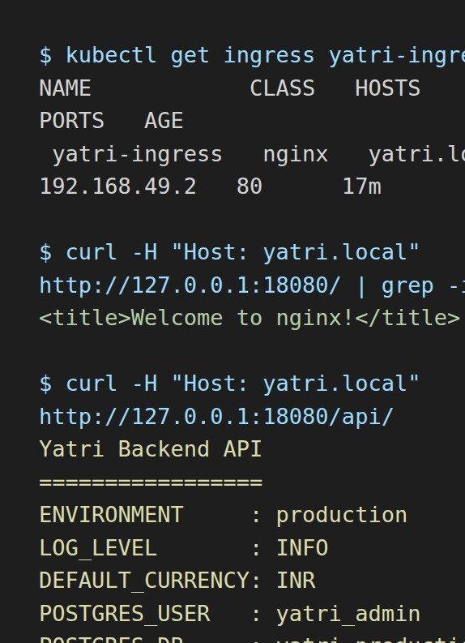

# Session 12: Kubernetes Ingress, ConfigMaps, and Secrets

## Submission Overview

This session demonstrates configuration management, secret handling, NGINX Ingress routing, TLS termination, and a complete multi-tier Minikube deployment.

Detailed manifests and lab notes are organized in:

- [01-configmap](01-configmap/README.md)
- [02-secret](02-secret/README.md)
- [03-ingress](03-ingress/README.md)
- [04-full-demo](04-full-demo/README.md)
- [Troubleshooting](troubleshooting/)

## Environment

- Kubernetes distribution: Minikube
- Ingress Controller: NGINX
- Namespace: `default`
- Application domain: `yatri.local`
- Workloads: NGINX frontend and Python backend

## Architecture

```text
Client
  |
  | yatri.local/
  | yatri.local/api/
  v
NGINX Ingress Controller
  |                         |
  v                         v
Frontend ClusterIP       Backend ClusterIP
  |                         |
  v                         v
NGINX Pods               Python Pods
                          |
                          +-- ConfigMap values
                          +-- Secret credentials
```

## Task 1: ConfigMap Configuration

The `yatri-app-config` ConfigMap stores non-sensitive runtime settings:

- `ENVIRONMENT=production`
- `LOG_LEVEL=INFO`
- `APP_PORT=5000`
- `DEFAULT_CURRENCY=INR`
- `MAX_BOOKING_DAYS=30`

Verification commands:

```bash
kubectl apply -f 01-configmap/app-config.yaml
kubectl describe configmap yatri-app-config
kubectl get configmap yatri-app-config -o jsonpath='{.data.ENVIRONMENT}'
```

## Task 2: ConfigMap Update and Pod Immutability

Environment variables loaded from a ConfigMap are fixed when the container starts. Updating the ConfigMap does not change the environment of an already-running container. A rollout restart is required:

```bash
kubectl patch configmap yatri-app-config --type merge -p '{"data":{"ENVIRONMENT":"staging"}}'
kubectl exec deploy/yatri-backend -- env | grep ENVIRONMENT
kubectl rollout restart deployment/yatri-backend
kubectl rollout status deployment/yatri-backend
kubectl exec deploy/yatri-backend -- env | grep ENVIRONMENT
```

After verification, restore `ENVIRONMENT=production` for the remaining tasks.

## Task 3: Kubernetes Secret and Base64

The `yatri-db-secret` Secret stores database credentials as Base64-encoded values. Base64 is encoding, not encryption.

```bash
kubectl apply -f 02-secret/db-secret.yaml
kubectl describe secret yatri-db-secret
kubectl get secret yatri-db-secret -o jsonpath='{.data.POSTGRES_PASSWORD}' | base64 --decode
```

The decoded classroom password is not exposed in application logs or the backend API response.

## Task 4: Trailing Newline Gotcha

`echo` adds a newline before encoding, while `echo -n` preserves the exact byte stream:

```bash
echo "secretpassword" | xxd
echo -n "secretpassword" | xxd
echo "secretpassword" | base64
echo -n "secretpassword" | base64
```

The correct Secret encoding must not contain the trailing `0a` newline byte.

## Task 5: Enterprise Secret Management

Secret YAML files should not be committed to source control because Git history, repository access, and backups can retain credentials indefinitely. Production alternatives include:

```text
AWS Secrets Manager / Azure Key Vault / HashiCorp Vault
                         |
                         v
External Secrets Operator or Vault Agent Injector
                         |
                         v
Kubernetes Secret
                         |
                         v
Pod environment variables or mounted volumes
```

External secret systems provide centralized RBAC, rotation, auditing, and short-lived access. CI/CD systems should inject deployment credentials at runtime through protected secret stores rather than storing them in manifests.

## Task 6: ConfigMap and Secret Injection

The backend consumes both sources:

- ConfigMap values through `envFrom.configMapRef`
- Secret values through `secretKeyRef`

```bash
kubectl apply -f 04-full-demo/configmap.yaml
kubectl apply -f 04-full-demo/secret.yaml
kubectl apply -f 04-full-demo/backend.yaml
kubectl rollout status deployment/yatri-backend
kubectl exec deploy/yatri-backend -- env | grep -E 'ENVIRONMENT|LOG_LEVEL|POSTGRES'
```

Expected injected values include `ENVIRONMENT=production`, `LOG_LEVEL=INFO`, `POSTGRES_USER=yatri_admin`, and `POSTGRES_DB=yatri_production_db`.

## Task 7: Ingress Resource versus Ingress Controller

| Component | Responsibility |
| --- | --- |
| Ingress Resource | Declarative Layer 7 rules containing hosts, paths, TLS references, and backend Services |
| Ingress Controller | Running reverse proxy that watches Ingress objects and configures NGINX, Traefik, HAProxy, or Envoy |

An Ingress resource does not route traffic by itself. The controller implements the routing behavior.

```bash
kubectl api-resources | grep -i ingress
```

## Task 8: NGINX Ingress Controller

Enable the Minikube addon and wait for the controller to become ready:

```bash
minikube addons enable ingress
kubectl get pods -n ingress-nginx
kubectl wait --namespace ingress-nginx \
  --for=condition=ready pod \
  --selector=app.kubernetes.io/component=controller \
  --timeout=120s
```

The completed demo used an `ingress-nginx-controller` Pod in `Running` and `Ready` state.

## Task 9: Local DNS Mapping

For a standard Minikube VM setup, map the Minikube IP to the application hostname:

```bash
MINIKUBE_IP=$(minikube ip)
echo "${MINIKUBE_IP}  yatri.local" | sudo tee -a /etc/hosts
grep yatri.local /etc/hosts
```

With the Docker driver, host access to the Minikube IP can be isolated. The demo was verified through a local port-forward with the `Host: yatri.local` header when direct host routing was unavailable.

## Task 10: Path-Based Routing

The demo Ingress routes:

- `/` to `yatri-frontend-service`
- `/api/` to `yatri-backend-service`

```bash
kubectl apply -f 04-full-demo/frontend.yaml
kubectl apply -f 04-full-demo/backend.yaml
kubectl apply -f 04-full-demo/ingress.yaml
kubectl describe ingress yatri-ingress
```

The `/api` rewrite removes the public prefix before the request reaches the backend application.

## Task 11: Host-Based Routing

Host-based rules allow multiple domains to share an Ingress address while selecting different backends:

```bash
curl -s -H 'Host: portal.campus.local' http://$(minikube ip)/
curl -s -H 'Host: api.campus.local' http://$(minikube ip)/api/
```

The domains can be mapped in `/etc/hosts` during local testing.

## Task 12: Hybrid Host and Path Routing

Hybrid routing combines both dimensions:

```text
portal.campus.local/      -> frontend Service
api.campus.local/api/     -> backend Service
```

Inspect the complete routing table:

```bash
kubectl apply -f 03-ingress/ingress-tls.yaml
kubectl get ingress campus-ingress-tls
kubectl describe ingress campus-ingress-tls
```

## Task 13: TLS Termination

A TLS Secret stores the certificate and private key used by the Ingress Controller:

```bash
openssl req -x509 -nodes -days 365 -newkey rsa:2048 \
  -keyout tls.key -out tls.crt \
  -subj '/CN=campus.local/O=CampusDevOps'
kubectl create secret tls campus-tls-cert --cert=tls.crt --key=tls.key
kubectl apply -f 03-ingress/ingress-tls.yaml
kubectl get ingress campus-ingress-tls
```

Test the local HTTPS endpoint with certificate verification disabled for the self-signed certificate:

```bash
curl -k -v --resolve portal.campus.local:443:$(minikube ip) \
  https://portal.campus.local/
```

## Task 14: End-to-End Demo and Automation

The full demo script enables Ingress, applies the ConfigMap and Secret, deploys both workloads, creates Services, applies routing rules, and waits for healthy Pods:

```bash
bash 04-full-demo/run-demo.sh
```

The completed run verified:

- `yatri-app-config` with five data keys
- `yatri-db-secret` with three data keys
- Two ready frontend Pods
- Two ready backend Pods
- `yatri-frontend-service` and `yatri-backend-service` ClusterIP Services
- `yatri-ingress` with host `yatri.local`
- Frontend response: `Welcome to nginx!`
- Backend response containing ConfigMap and database configuration
- Environment injection inside the backend Pod

### Submitted Terminal Evidence



The screenshot shows the successful Ingress lookup, frontend request, backend API response, and injected environment values.

Clean up the demo resources after testing:

```bash
bash 04-full-demo/cleanup.sh
```

## Final Summary

ConfigMaps provide non-sensitive configuration, Secrets provide credential storage with access control, and Ingress provides a single Layer 7 entry point for multiple internal Services. The full demo combines all three patterns into a repeatable Minikube deployment.
