# Session 14: Kubernetes Troubleshooting

## Problem Statement

Kubernetes applications can fail for different reasons: the container may crash, an image may not be available, a Pod may not be schedulable, or a Service may not route traffic to the correct Pods. The goal of this homework was to use Kubernetes commands to identify the problem, investigate it, fix the root cause, and verify the result.

Environment used during the practical work:

- Kubernetes cluster: Minikube
- Namespace: `default`
- Main tools: `kubectl` and a terminal shell

## Troubleshooting Workflow

The workflow used for each problem was:

1. Identify the failing resource and record its status.
2. Inspect the resource with `kubectl get` and `kubectl get -o wide`.
3. Investigate details with `kubectl describe`.
4. Check Kubernetes Events.
5. Read application output with `kubectl logs`.
6. Enter a running container with `kubectl exec` when possible.
7. Check labels, selectors, endpoints, DNS, and network connectivity.
8. Correct the manifest or configuration.
9. Recreate or update the resource.
10. Verify that the resource is healthy and that connectivity works.

## Task 1: Kubernetes Commands

### `kubectl get`

Used to view the current state of Pods, Services, Deployments, and Nodes.

```bash
kubectl get pods
kubectl get services
kubectl get deployments
kubectl get nodes
kubectl get all
```

The captured output showed `get-demo` in the `Running` state and the Minikube node as `Ready`.

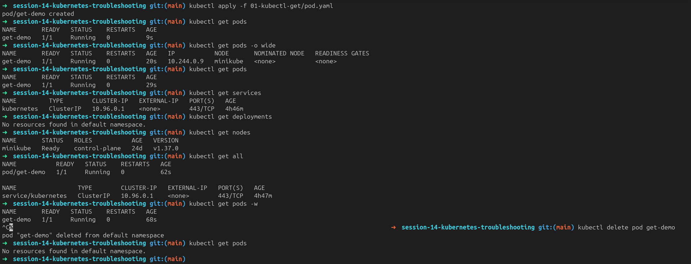

### `kubectl get -o wide`

Used to view additional placement and networking information such as the Pod IP and node.

```bash
kubectl get pods -o wide
kubectl get nodes -o wide
```

The output displayed the Pod IP `10.244.0.9` and the node `minikube`.

### `kubectl describe`

Used to inspect resource configuration, container state, conditions, mounts, and Events.

```bash
kubectl describe pod describe-demo
kubectl describe service <service-name>
```

The `describe-demo` output showed a running Nginx container, readiness conditions set to `True`, and normal Scheduled, Pulled, Created, and Started Events.

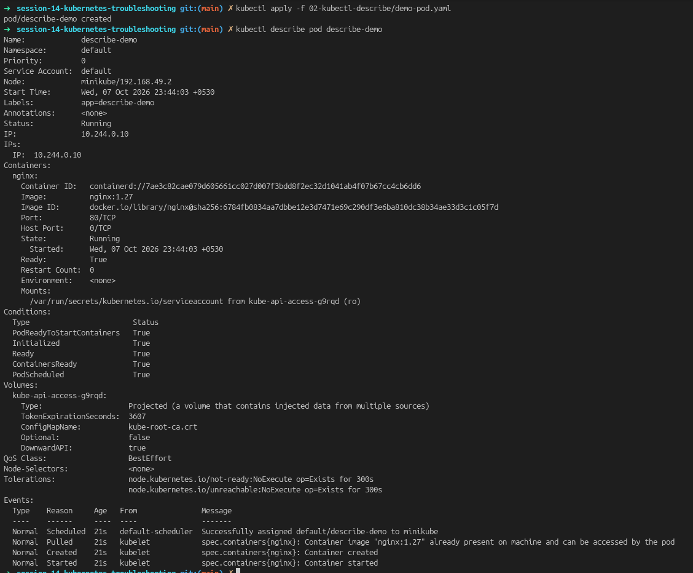

### `kubectl logs`

Used to inspect application output and diagnose startup or runtime failures.

```bash
kubectl logs logs-demo
kubectl logs -f logs-demo
kubectl logs <pod-name> -c <container-name>
kubectl logs <pod-name> --previous
```

The captured logs showed the application starting, connecting to its database successfully, and reporting that it was healthy.

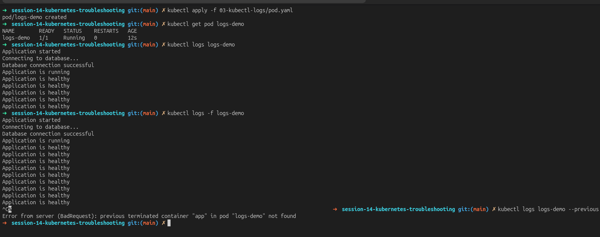

### `kubectl exec`

Used to run commands inside a running container and test the container from the inside.

```bash
kubectl exec -it exec-demo -- bash
ls /usr/share/nginx/html/
curl localhost
exit
kubectl exec exec-demo -- hostname
```

The first command used an invalid flag (`--bash`). The corrected command used `-- bash`, opened the container, listed the Nginx web root, and confirmed the Nginx welcome page with `curl localhost`.

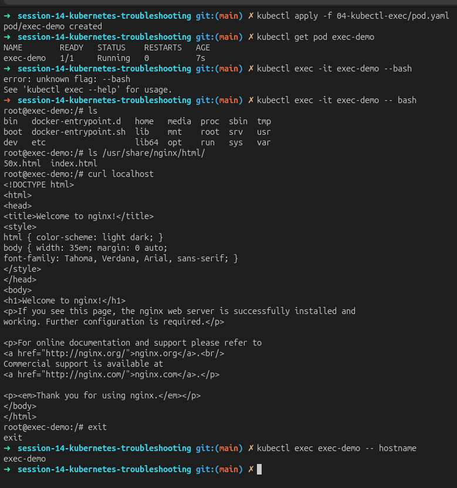

### `kubectl events`

Used to see what Kubernetes attempted and whether scheduling, image pulling, container creation, and startup succeeded.

```bash
kubectl get events --sort-by=.lastTimestamp
kubectl events
kubectl describe pod events-demo
```

The Events output showed normal Scheduled, Pulled, Created, and Started events for the demonstration Pods.

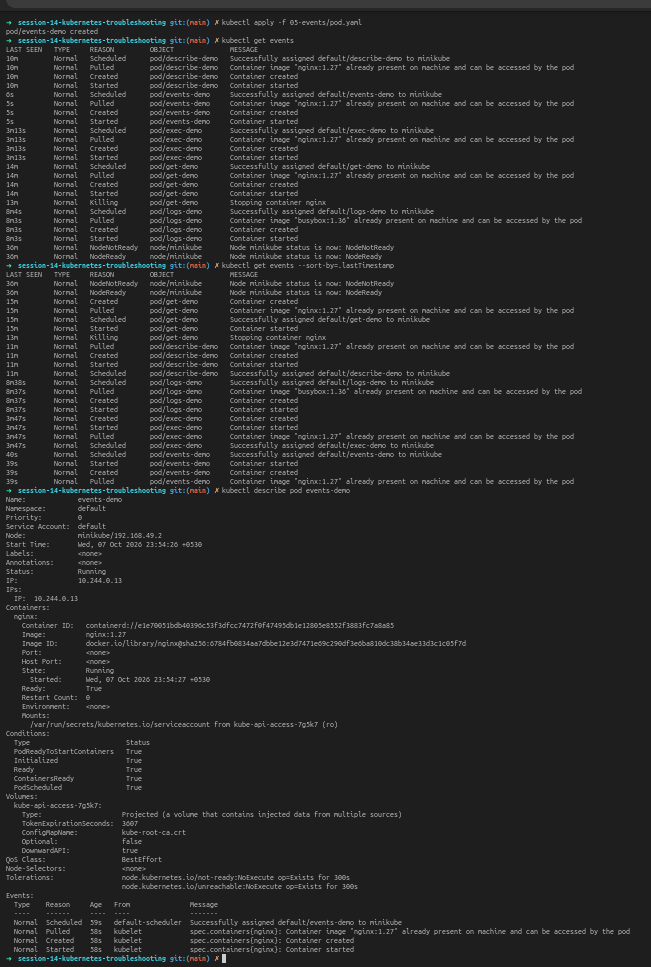

### `kubectl explain`

Used to read the Kubernetes API documentation directly from the cluster.

```bash
kubectl explain pod
kubectl explain pod.spec.containers
kubectl explain service.spec.selector
kubectl explain deployment.spec.template.spec
```

### `kubectl top`

Used to inspect CPU and memory usage. The Metrics Server must be available in the cluster.

```bash
kubectl top nodes
kubectl top pods
kubectl top pod <pod-name> --containers
```

If this command reports that Metrics API data is unavailable, the next investigation step is to check the Metrics Server installation and status.

## Task 2: Common Kubernetes Issues

### 1. CrashLoopBackOff

**Problem:** `crash-demo` repeatedly started and stopped, and its status showed `Error` with restarts.

**Investigation:**

```bash
kubectl get pod crash-demo
kubectl describe pod crash-demo
kubectl logs crash-demo
kubectl logs crash-demo --previous
```

**Root cause:** The container command printed a startup message and then ran `exit 1`, so the process terminated with exit code `1`. Kubernetes restarted it and eventually reported `CrashLoopBackOff`.

**Solution:** Replace the failing command with a valid long-running command or correct the application configuration. The fixed manifest was applied and the Pod was recreated.

**Verification:** Confirm the Pod reaches `Running`, the restart count stops increasing, and the logs show normal startup.

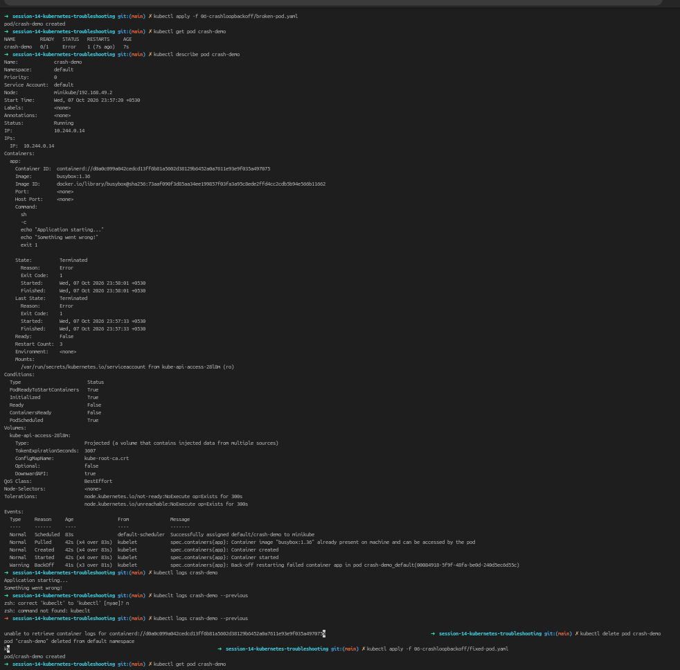

### 2. ErrImagePull and ImagePullBackOff

**Problem:** `image-demo` showed `ErrImagePull` and then `ImagePullBackOff`.

**Investigation:**

```bash
kubectl get pod image-demo
kubectl describe pod image-demo
kubectl get events --sort-by=.lastTimestamp
```

**Root cause:** The manifest requested the nonexistent image `nginx:this-image-does-not-exist`. Kubernetes could not pull it from the registry.

**Solution:** Change the image to a valid image, such as `nginx:1.27`, and apply the corrected manifest.

```bash
kubectl delete pod image-demo
kubectl apply -f 07-imagepullbackoff/fixed-pod.yaml
```

**Verification:** `kubectl get pod image-demo` showed `1/1 Running` after the fix.

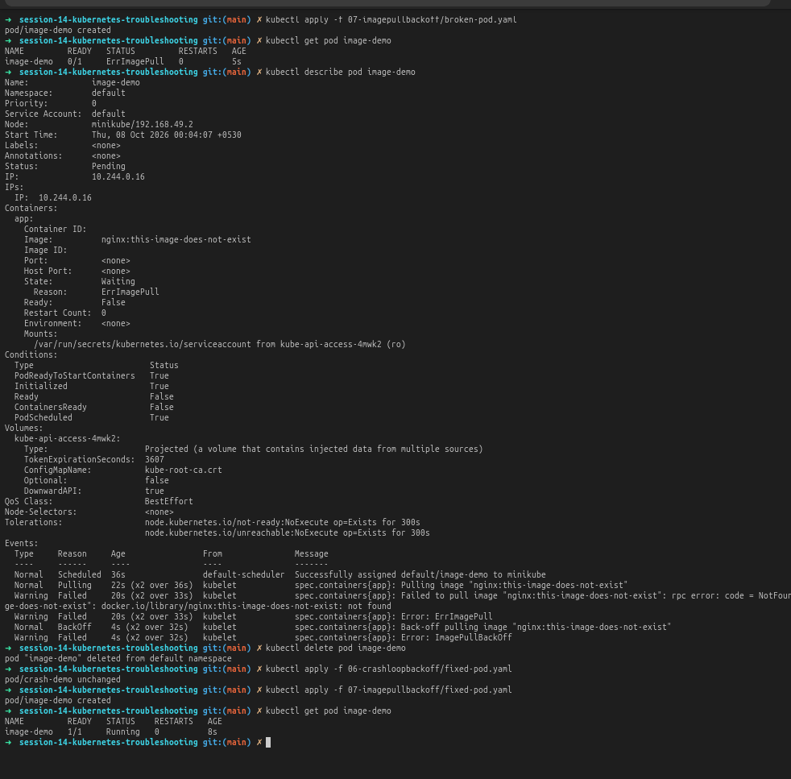

### 3. Pending Pod

**Problem:** `pending-demo` remained in the `Pending` state and had no assigned node.

**Investigation:**

```bash
kubectl get pod pending-demo
kubectl describe pod pending-demo
kubectl get nodes
```

**Root cause:** The Pod used the node selector `kubernetes.io/hostname=node-that-does-not-exist`, which did not match the available Minikube node.

**Solution:** Remove the invalid selector or replace it with a label that exists on an available node, then apply the fixed manifest.

**Verification:** The fixed Pod reached `1/1 Running`.

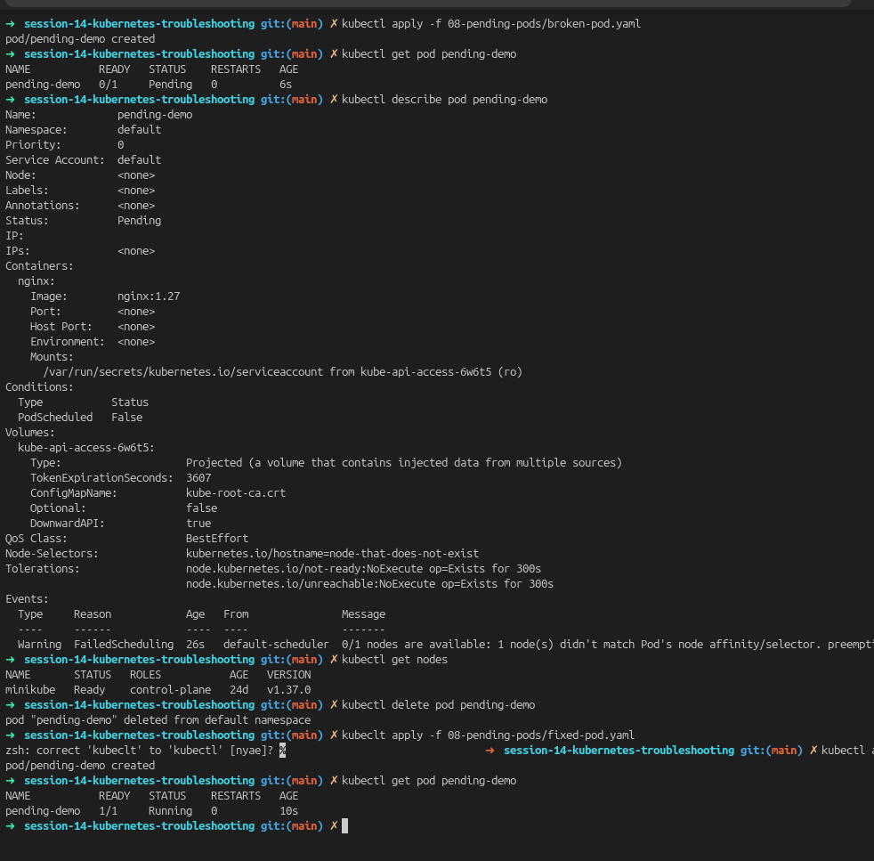

### 4. ContainerCreating

**Problem:** A Pod in `ContainerCreating` has been scheduled, but its container is not ready yet.

**Investigation commands:**

```bash
kubectl get pod <pod-name> -o wide
kubectl describe pod <pod-name>
kubectl get events --sort-by=.lastTimestamp
```

**Root cause checks:** Look for image-pull failures, volume-mount errors, missing Secrets or ConfigMaps, CNI problems, or permission errors in the Events section.

**Solution and verification:** Correct the failing image, volume, configuration object, or node issue identified in Events. Confirm that the container becomes `Running` and that `Ready` changes to `True`.

### 5. Service Connectivity Issue

**Problem:** `web-service` existed, but it had no endpoints in the initial check.

**Investigation:**

```bash
kubectl get pods --show-labels
kubectl get service web-service
kubectl describe service web-service
kubectl get endpoints web-service
kubectl get endpointslice -l kubernetes.io/service-name=web-service
```

**Root cause:** The Service selector `app=web-absdgf` did not match the labels on the application Pods, so the Service had no usable backend endpoints.

**Solution:** Make the Service selector match the Deployment Pod labels, or correct the Pod labels, then apply the manifest again.

**Verification:** The Service displayed backend endpoints and the application Pods were `Ready`.

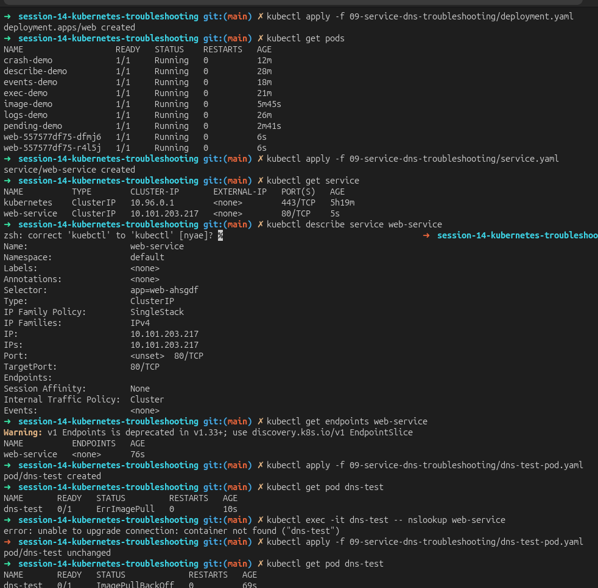

### 6. DNS Issue

**Problem:** DNS testing could not proceed because the test Pod was not running. The captured output showed `ErrImagePull`/`ImagePullBackOff` for `dns-test` and an exec failure because the container was not found.

**Investigation:**

```bash
kubectl get pod dns-test
kubectl describe pod dns-test
kubectl get pods -n kube-system
kubectl exec -it dns-test -- nslookup web-service
kubectl logs -n kube-system -l k8s-app=kube-dns
```

**Root cause:** The DNS test container could not start because its image was not available. This was an infrastructure/test-Pod issue before a DNS lookup could be validated.

**Solution:** Fix the test Pod image, wait until it is `Running`, and then test the Service name again. If lookup still fails, investigate CoreDNS and the Service name/namespace.

**Verification:** A successful lookup should resolve `web-service` to the Service ClusterIP, for example `web-service.default.svc.cluster.local`.

### 7. Pod Networking Issue

**Investigation commands:**

```bash
kubectl get pods -o wide
kubectl get nodes -o wide
kubectl describe pod <pod-name>
kubectl exec <pod-name> -- ip addr
kubectl exec <pod-name> -- ip route
kubectl exec <pod-name> -- curl -v <service-name>:<port>
```

**Root cause checks:** Compare Pod IPs, node placement, routes, CNI status, NetworkPolicies, and the destination Service endpoints.

**Solution and verification:** Correct the NetworkPolicy, CNI, route, or Service configuration found during investigation. Verify Pod-to-Pod and Pod-to-Service traffic from inside a running test Pod.

### 8. Configuration Issue

**Investigation commands:**

```bash
kubectl get pod <pod-name> -o yaml
kubectl describe pod <pod-name>
kubectl get configmap
kubectl get secret
kubectl describe configmap <configmap-name>
kubectl describe secret <secret-name>
```

**Root cause checks:** Look for incorrect environment variables, missing keys, wrong ConfigMap or Secret names, invalid command arguments, and incorrect ports.

**Solution and verification:** Correct the configuration source or Pod reference, restart or roll out the workload, and verify the new environment/configuration through Pod status and logs.

## Task 3: Mini Project

The mini project combined Pod, Service, endpoint, log, and event investigation.

### Problem Statement

The application resources were deployed, but the troubleshooting process needed to confirm whether the Pods were healthy, whether the Service had endpoints, and whether a broken workload could be identified from its image and Events.

### Investigation

```bash
kubectl get pods -o wide
kubectl get services
kubectl describe service troubleshooting-service
kubectl get endpoints troubleshooting-service
kubectl apply -f broken-pod.yaml
kubectl get pod project-broken-pod
kubectl describe pod project-broken-pod
```

### Root Cause

The broken project Pod used the nonexistent image `nginx:this-tag-does-not-exist`, producing `ErrImagePull` followed by `ImagePullBackOff`. Service investigation also required checking whether the selector matched the application Pods and whether endpoints existed.

### Solution

Use a valid image tag and ensure that the Service selector matches the labels on the Deployment template. Reapply the corrected resources and wait for the Pods to become ready.

### Before and After

Before the fix:

```text
project-broken-pod   0/1   ErrImagePull/ImagePullBackOff
Endpoints            <none> when the Service selector did not match
```

After the fix:

```text
project-broken-pod   1/1   Running
Service              has matching backend endpoints
```

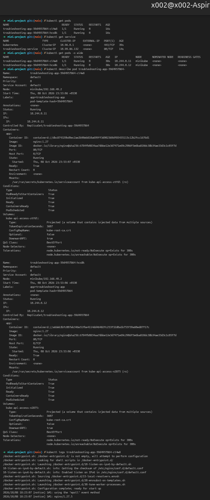

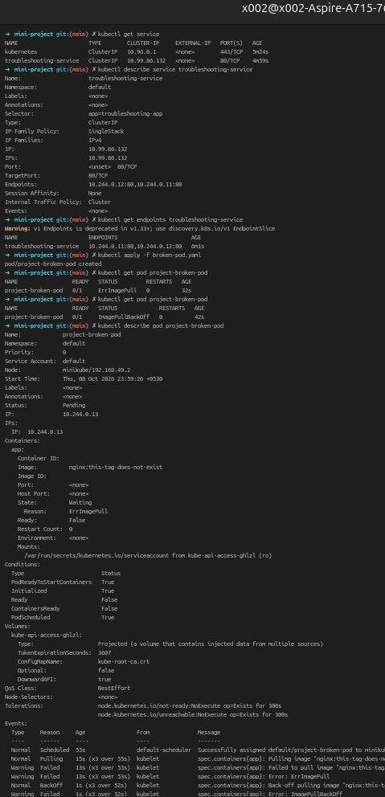

## Evidence Gallery

| Evidence | Screenshot |
| --- | --- |
| `kubectl get` and `kubectl get -o wide` | [t1-get.png](t1-get.png) |
| `kubectl describe` | [t1_describe.png](t1_describe.png) |
| `kubectl logs` | [t1-logs.png](t1-logs.png) |
| `kubectl exec` | [t1-exec.png](t1-exec.png) |
| Events | [t1-events.png](t1-events.png) |
| CrashLoopBackOff | [t1-crashloopbackoff.png](t1-crashloopbackoff.png) |
| ErrImagePull/ImagePullBackOff | [t1-imagepullbackoff.png](t1-imagepullbackoff.png) |
| Pending Pod | [t1-pending.png](t1-pending.png) |
| Service and DNS troubleshooting | [t1-service-dns-troubleshooting.png](t1-service-dns-troubleshooting.png) |
| Mini project Pod | [t1-pod-part-mini-project.png](t1-pod-part-mini-project.png) |
| Mini project Service | [t1-service-part-mini-project.png](t1-service-part-mini-project.png) |

## Conclusion

The exercises demonstrated that Kubernetes troubleshooting should begin with resource status, continue through descriptions, Events, and logs, and then move to container-level, Service, DNS, and networking tests. The root cause should be corrected in the manifest or configuration, followed by a fresh status and connectivity check to verify the solution.
