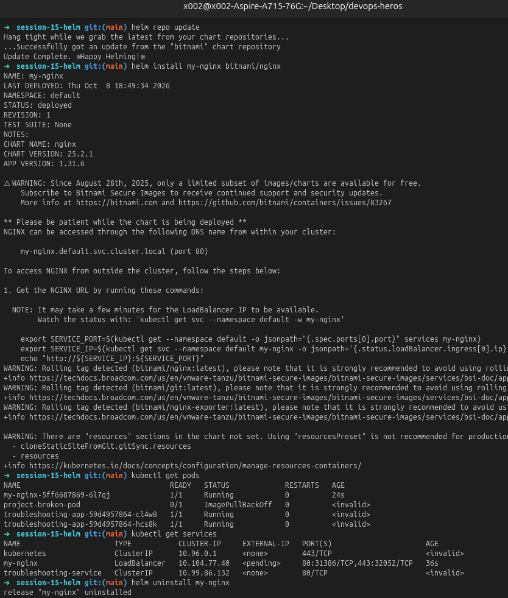
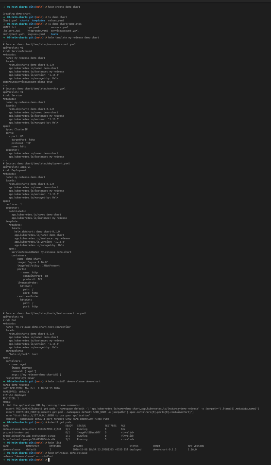
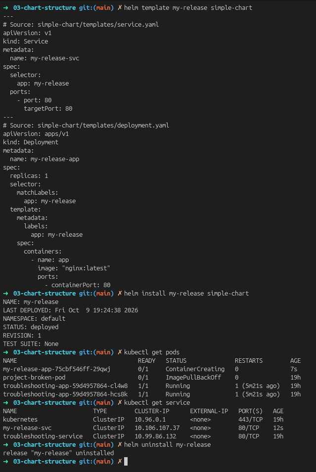
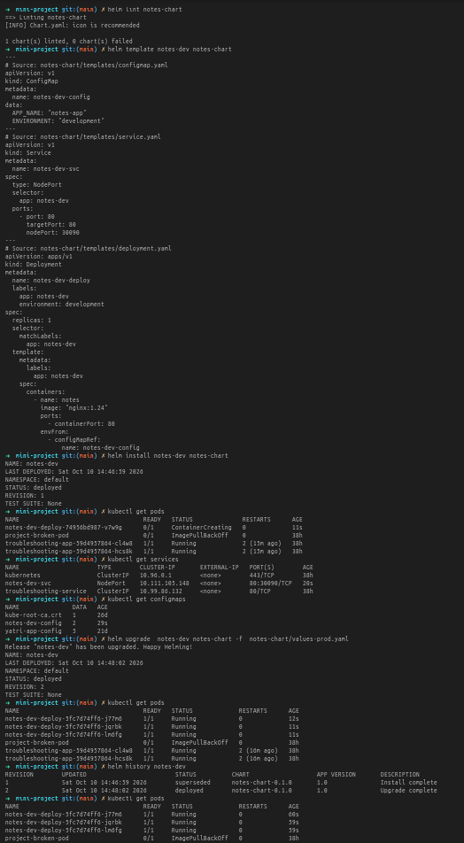

# Session 15: Helm

This session focused on learning Helm, the package manager for Kubernetes, and practicing the full lifecycle of a Helm release: create, install, upgrade, verify, rollback, and uninstall.

---

## Objectives

- Understand what Helm is and why it is useful in Kubernetes
- Create a chart from scratch
- Install and manage applications with Helm
- Upgrade a deployment with custom values
- Roll back to a previous release version
- Deploy a small mini-project using Helm

---

## Key Helm Concepts

- Chart: a packaged Kubernetes application
- Release: an installed instance of a chart in a cluster
- Values: configuration parameters used to customize a chart
- Template: YAML files rendered with Go templates and values

---

## Important Helm Commands Covered in the Lab

### 1. helm repo update

Purpose: refresh the local chart repository metadata.

```bash
helm repo update
```

Observed output from the lab:

```text
Hang tight while we grab the latest from your chart repositories...
...Successfully got an update from the "bitnami" chart repository
Update Complete. ⎈Happy Helming!⎈
```

---

### 2. helm install

Purpose: deploy a chart to the cluster.

```bash
helm install my-nginx bitnami/nginx
```

Observed output:

```text
NAME: my-nginx
LAST DEPLOYED: Thu Oct  8 18:49:34 2026
NAMESPACE: default
STATUS: deployed
REVISION: 1
TEST SUITE: None
NOTES:
CHART: nginx
CHART VERSION: 25.2.1
APP VERSION: 1.31.6
```

This created a running nginx deployment from the Bitnami chart.

---

### 3. helm list

Purpose: see all Helm releases in the current namespace.

```bash
helm list
```

Observed output:

```text
NAME            NAMESPACE   REVISION STATUS   CHART          APP VERSION
my-nginx        default     1        deployed nginx         1.31.6
```

---

### 4. helm status

Purpose: display the current status and metadata for a release.

```bash
helm status my-nginx
```

Typical output:

```text
NAME: my-nginx
LAST DEPLOYED: Thu Oct  8 18:49:34 2026
NAMESPACE: default
STATUS: deployed
REVISION: 1
```

---

### 5. helm get

Purpose: inspect the generated manifest or values for a release.

```bash
helm get values my-nginx
helm get manifest my-nginx
```

This helps confirm what Helm rendered before and after modifications.

---

### 6. helm upgrade

Purpose: upgrade a release by changing the chart version or values.

```bash
helm upgrade my-nginx bitnami/nginx --set replicaCount=3
```

Typical output:

```text
Release "my-nginx" has been upgraded.
NAME: my-nginx
LAST DEPLOYED: Thu Oct  8 18:49:34 2026
NAMESPACE: default
STATUS: deployed
REVISION: 2
```

---

### 7. helm history

Purpose: show the revision history of a release.

```bash
helm history my-nginx
```

Typical output:

```text
REVISION  UPDATED                   STATUS     CHART         APP VERSION
1         Thu Oct 8 ...            deployed   nginx         1.31.6
2         Thu Oct 8 ...            deployed   nginx         1.31.6
```

---

### 8. helm rollback

Purpose: revert a release to a previous successful revision.

```bash
helm rollback my-nginx 1
```

Observed output in the lab:

```text
Rollback was a success.
Happy Helming!
```

---

### 9. helm uninstall

Purpose: remove a release and its related Kubernetes resources.

```bash
helm uninstall my-nginx
```

Observed output:

```text
release "my-nginx" uninstalled
```

---

### 10. helm repo

Purpose: manage repositories for Helm charts.

```bash
helm repo add bitnami https://charts.bitnami.com/bitnami
helm repo list
```

This is how Helm pulls charts such as nginx, mysql, redis, and many others.

---

### 11. helm search

Purpose: search for charts in the configured repositories.

```bash
helm search repo nginx
```

Typical output:

```text
NAME                 CHART VERSION APP VERSION DESCRIPTION
bitnami/nginx        25.2.1        1.31.6      NGINX Open Source
```

---

### 12. helm create

Purpose: generate a starter chart structure.

```bash
helm create simple-chart
```

Generated folder structure:

```text
simple-chart/
  Chart.yaml
  values.yaml
  templates/
    deployment.yaml
    service.yaml
    helpers.tpl
    tests/
```

This created the base template for a chart.

---

### 13. helm template

Purpose: render chart templates locally without installing them.

```bash
helm template my-release simple-chart
```

This is useful to validate YAML and template logic before deploying.

---

## Rollback Workflow (Complete Practice)

The lab also demonstrated the full release lifecycle using Helm.

```bash
helm install my-release simple-chart
helm upgrade my-release simple-chart --set replicaCount=3
helm history my-release
helm rollback my-release 1
helm status my-release
kubectl get pods
kubectl get services
```

Flow:

1. Install
2. Upgrade
3. Verify resources and revision
4. Upgrade again
5. Verify application state
6. Roll back to a previous revision
7. Confirm rollback succeeded

---

## Screenshot Evidence

### Helm basic commands and install



### Helm chart creation and chart structure





### Mini project demo



---

## Mini Project: notes-chart

A mini Helm project was created inside the folder:

```text
mini-project/notes-chart/
```

This chart contains:

- `Chart.yaml`
- `values.yaml`
- `templates/configmap.yaml`
- `templates/deployment.yaml`
- `templates/service.yaml`

### Key commands used

```bash
helm lint notes-chart
helm template notes-dev notes-chart
helm install notes-dev notes-chart
kubectl get pods
kubectl get services
kubectl get configmaps
helm upgrade notes-dev notes-chart -f notes-chart/values-prod.yaml
helm history notes-dev
helm rollback notes-dev 1
helm uninstall notes-dev
```

### What the chart does

- deploys a containerized app using nginx
- creates a ConfigMap with environment values
- creates a Deployment with configurable replica count
- exposes the app with a NodePort Service

---

## Practical Learning Summary

Helm simplifies Kubernetes deployments by packaging applications into reusable charts and allowing safe upgrades and rollbacks.

In this session, the most important lesson was:

> A Helm chart is not only deployment logic, it is also versioned release management.

This means you can:

- deploy consistently across environments
- change settings using values files
- track every revision with `helm history`
- recover quickly with `helm rollback`

---

## References

- Helm official docs: https://helm.sh/docs/
- Helm chart template guide: https://helm.sh/docs/chart_template_guide/
- Bitnami charts: https://artifacthub.io/packages/search?kind=0&sort=relevance&page=1
