# Kubernetes Core Objects Lab

This README is the execution guide for the Lecture 10 tasks. Run commands from
the `session10-k8s-core-objects` directory unless a command includes another `cd`.

## Screenshots

### 1. Cluster Health

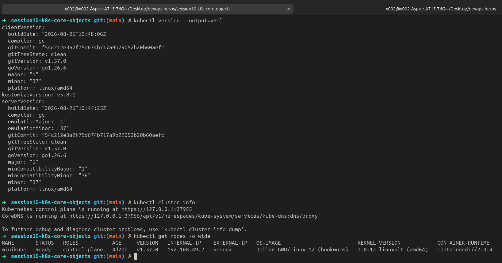

### 2. Nginx Pod Operations

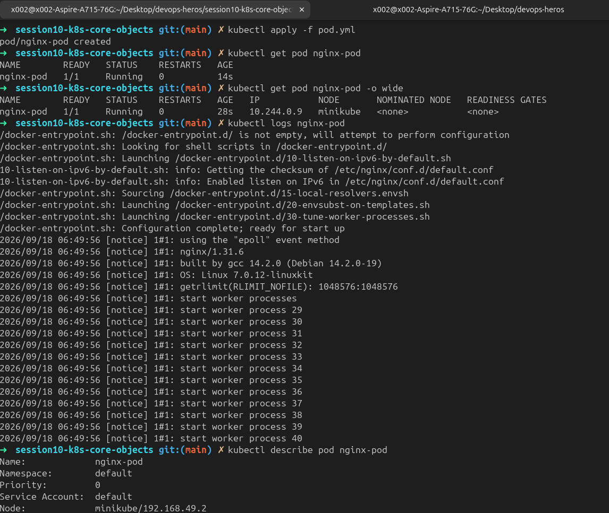

### 3. Image Pull Backoff

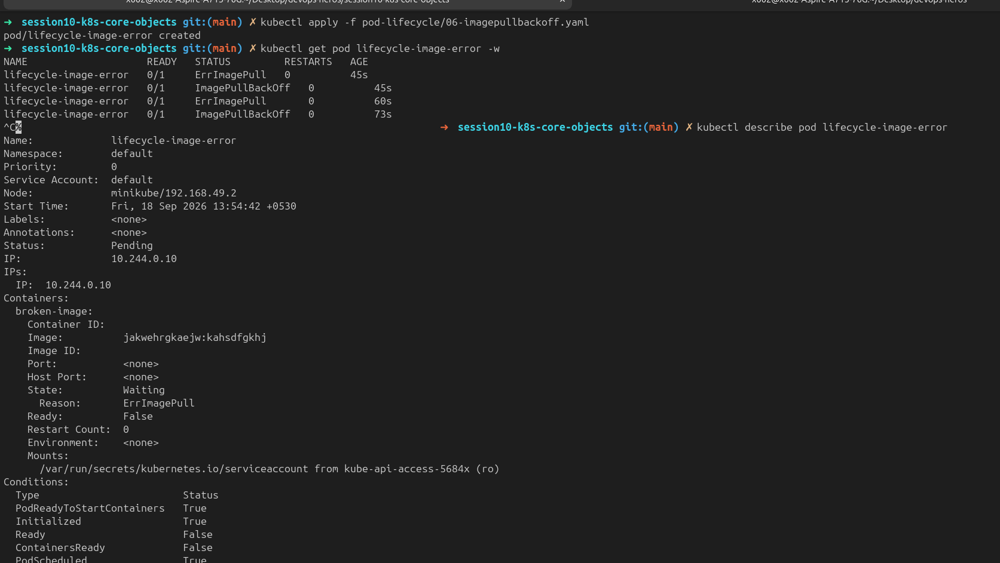

### 4. Pod Lifecycle Stages

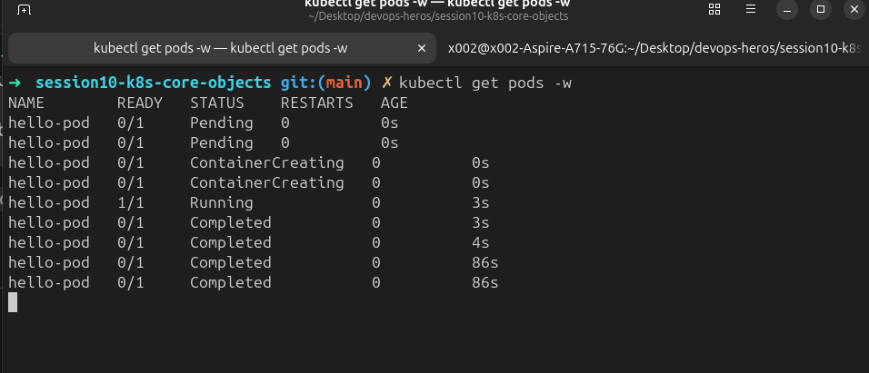

### 5. Init Container and Multi-Container Pod

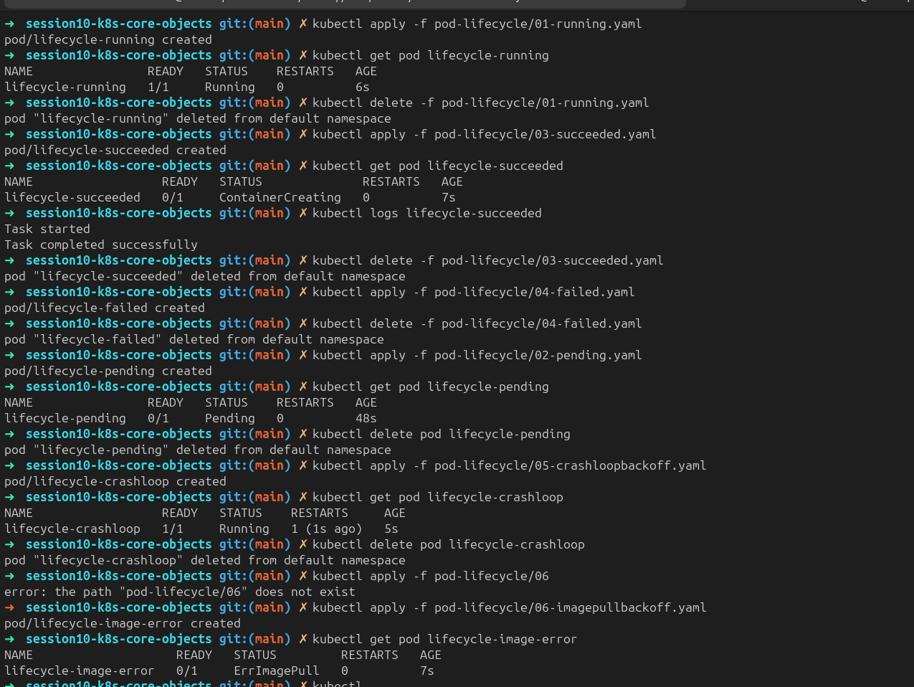

### 6. ReplicaSet and StatefulSet

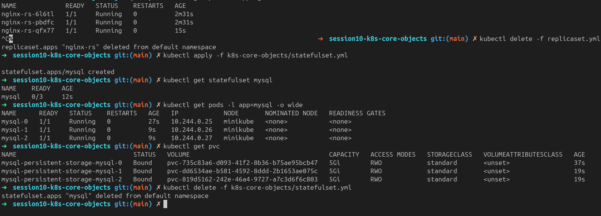

### 7. DaemonSet Verification

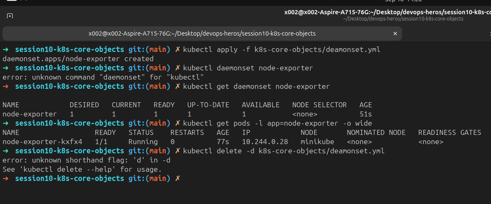

### 8. Rolling Update and Rollback

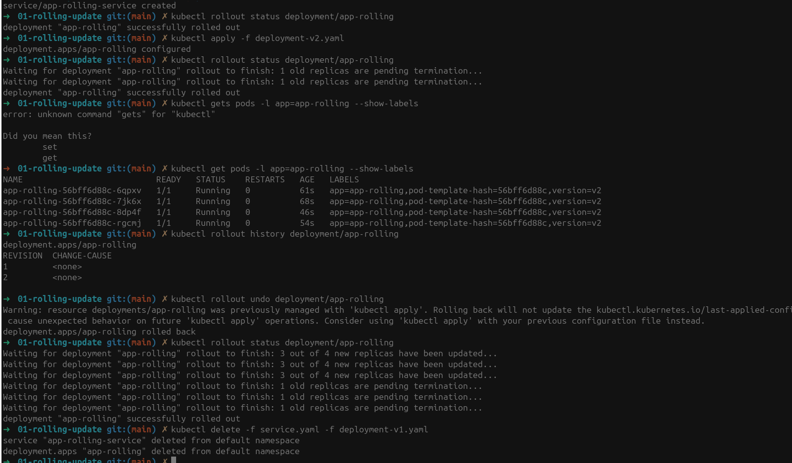

### 9. Troubleshooting Drills

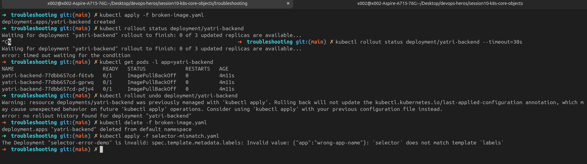

### 11. Blue-Green Cutover

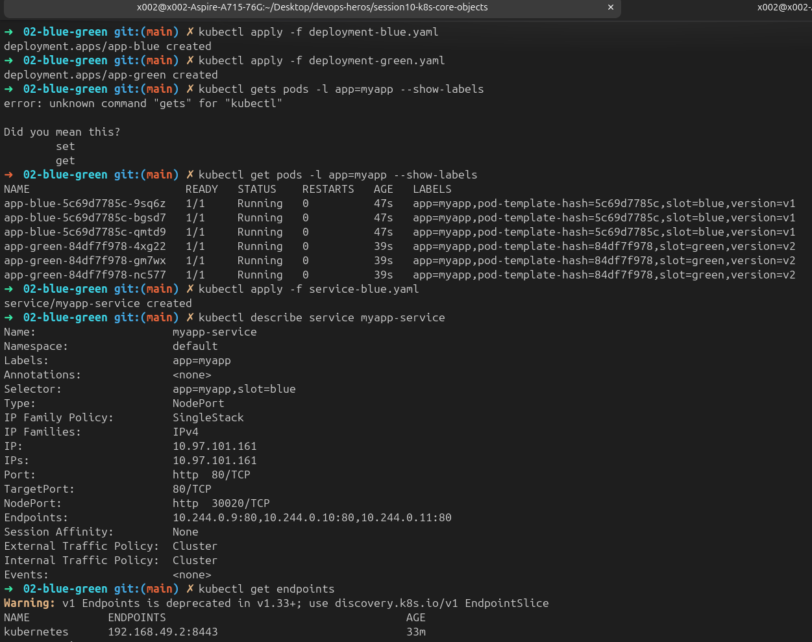

### 12. Canary Traffic Split

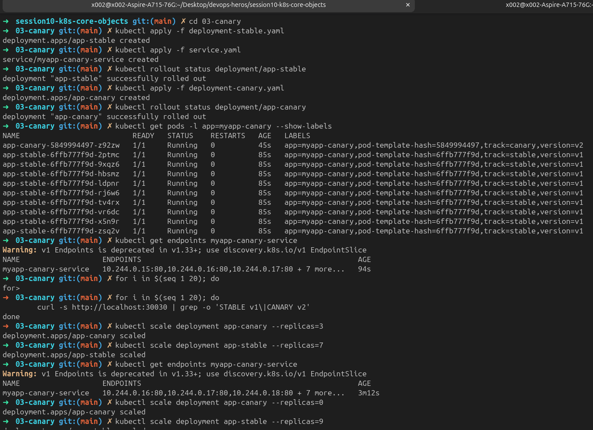

### 13. Recreate Downtime Outage

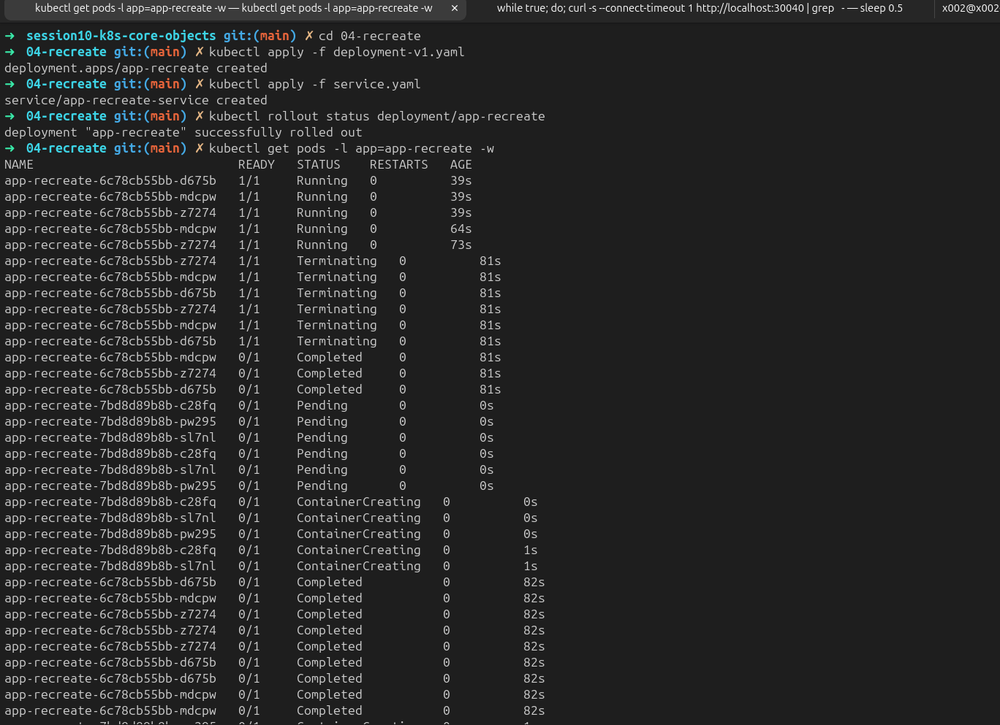

## 0. Prerequisites

You need a local Kubernetes cluster and the `kubectl` CLI. Start one cluster before
beginning. For Minikube:

```bash
minikube start
kubectl version --output=yaml
kubectl cluster-info
kubectl get nodes -o wide
```

Every node should show `Ready`. Run `kubectl config current-context` if you are
unsure which cluster receives your commands.

## 1. Cluster Health

```bash
kubectl version --output=yaml
kubectl cluster-info
kubectl get nodes -o wide
```

Screenshot: `01-cluster-health.png`

## 2. Standalone Nginx Pod

The manifest contains the required top-level fields: `apiVersion`, `kind`,
`metadata`, and `spec`.

```bash
kubectl apply -f pod.yml
kubectl get pod nginx-pod
kubectl get pod nginx-pod -o wide
kubectl logs nginx-pod
kubectl describe pod nginx-pod
kubectl delete -f pod.yml
kubectl get pods
```

Wait for `1/1 Running` before taking the screenshot. Screenshot:
`02-nginx-pod-operations.png`.

## 3. Image Pull Failure

The API server can store a Pod object in `etcd` even though the node cannot start
its container. The Kubelet then reports the image-pull error.

```bash
kubectl apply -f pod-lifecycle/06-imagepullbackoff.yaml
kubectl get pod lifecycle-image-error -w
kubectl describe pod lifecycle-image-error
kubectl get events --field-selector involvedObject.name=lifecycle-image-error \
	--sort-by=.lastTimestamp
kubectl delete -f pod-lifecycle/06-imagepullbackoff.yaml
```

Look for `ErrImagePull`, `ImagePullBackOff`, and `Failed to pull image`.
Screenshot: `03-imagepullbackoff-error.png`.

## 4. Short-Lived Pod

Use two terminals so the short lifecycle is visible.

Terminal 1:

```bash
kubectl get pods -w
```

Terminal 2:

```bash
kubectl apply -f hello.yml
kubectl get pod hello-pod
kubectl logs hello-pod
kubectl get pod hello-pod -o jsonpath='{.status.phase}{"\n"}'
kubectl delete -f hello.yml
```

The expected progression is `ContainerCreating` -> `Running` -> `Completed`.
Screenshot: `04-pod-lifecycle-stages.png`.

## 5. Pod Lifecycle and Probes

Run these examples one at a time and delete each one before starting the next.

```bash
# Basic lifecycle states
kubectl apply -f pod-lifecycle/01-running.yaml
kubectl get pod lifecycle-running
kubectl delete -f pod-lifecycle/01-running.yaml

kubectl apply -f pod-lifecycle/03-succeeded.yaml
kubectl get pod lifecycle-succeeded
kubectl logs lifecycle-succeeded
kubectl delete -f pod-lifecycle/03-succeeded.yaml

kubectl apply -f pod-lifecycle/04-failed.yaml
kubectl get pod lifecycle-failed
kubectl describe pod lifecycle-failed
kubectl delete -f pod-lifecycle/04-failed.yaml

# Scheduling and restart behavior
kubectl apply -f pod-lifecycle/02-pending.yaml
kubectl get pod lifecycle-pending
kubectl describe pod lifecycle-pending
kubectl delete -f pod-lifecycle/02-pending.yaml

kubectl apply -f pod-lifecycle/05-crashloopbackoff.yaml
kubectl get pod lifecycle-crashloop -w
kubectl logs lifecycle-crashloop --previous
kubectl delete -f pod-lifecycle/05-crashloopbackoff.yaml

kubectl apply -f pod-lifecycle/06-imagepullbackoff.yaml
kubectl get pod lifecycle-image-error -w
kubectl delete -f pod-lifecycle/06-imagepullbackoff.yaml

# Probes
kubectl apply -f pod-lifecycle/07-readiness.yaml
kubectl get pod lifecycle-readiness -w
kubectl describe pod lifecycle-readiness
kubectl delete -f pod-lifecycle/07-readiness.yaml

kubectl apply -f pod-lifecycle/08-liveness.yaml
kubectl get pod lifecycle-liveness -w
kubectl describe pod lifecycle-liveness
kubectl delete -f pod-lifecycle/08-liveness.yaml

kubectl apply -f pod-lifecycle/09-startup.yaml
kubectl get pod lifecycle-startup -w
kubectl describe pod lifecycle-startup
kubectl delete -f pod-lifecycle/09-startup.yaml

# Init container, sidecar, and graceful termination
kubectl apply -f pod-lifecycle/10-init-container.yaml
kubectl describe pod lifecycle-init
kubectl delete -f pod-lifecycle/10-init-container.yaml

kubectl apply -f pod-lifecycle/11-multi-container.yaml
kubectl get pod lifecycle-multi-container
kubectl logs lifecycle-multi-container -c sidecar
kubectl delete -f pod-lifecycle/11-multi-container.yaml

kubectl apply -f pod-lifecycle/12-termination.yaml
kubectl get pod lifecycle-termination
kubectl delete -f pod-lifecycle/12-termination.yaml
```

Screenshots: `05-lifecycle-probes-crashloop.png` and
`05-lifecycle-init-multicontainer.png`.

## 6. ReplicaSet and StatefulSet

The ReplicaSet in this checkout is named `myapp-rs` and uses the label `app=web`.

```bash
kubectl apply -f k8s-core-objects/replicaset.yml
kubectl get rs myapp-rs
kubectl get pods -l app=web -o wide
POD_NAME=$(kubectl get pods -l app=web -o jsonpath='{.items[0].metadata.name}')
kubectl delete pod "$POD_NAME"
kubectl get pods -l app=web -w
kubectl delete -f k8s-core-objects/replicaset.yml
```

The StatefulSet creates predictable names and PVCs:

```bash
kubectl apply -f k8s-core-objects/statefulset.yml
kubectl get statefulset mysql
kubectl get pods -l app=mysql -o wide
kubectl get pvc
kubectl delete -f k8s-core-objects/statefulset.yml
```

The checked-in StatefulSet requests three `5Gi` PVCs. Screenshot:
`06-controllers-rs-statefulset.png`.

## 7. DaemonSet

The repository file is named `deamonset.yml` with the existing spelling. It
creates one `node-exporter` pod on each eligible node.

```bash
kubectl apply -f k8s-core-objects/deamonset.yml
kubectl get daemonset node-exporter
kubectl get pods -l app=node-exporter -o wide
kubectl delete -f k8s-core-objects/deamonset.yml
```

Screenshot: `07-daemonset-verification.png`.

## 8. Rolling Update and Rollback

```bash
cd 01-rolling-update
kubectl apply -f deployment-v1.yaml
kubectl apply -f service.yaml
kubectl rollout status deployment/app-rolling
kubectl apply -f deployment-v2.yaml
kubectl rollout status deployment/app-rolling
kubectl get pods -l app=app-rolling --show-labels
kubectl rollout history deployment/app-rolling
kubectl rollout undo deployment/app-rolling
kubectl rollout status deployment/app-rolling
kubectl delete -f service.yaml -f deployment-v1.yaml
cd ..
```

The deployment uses `maxSurge: 1` and `maxUnavailable: 0`. Screenshot:
`08-rolling-update-and-rollback.png`.

## 9. Troubleshooting Drills

```bash
cd troubleshooting
kubectl apply -f broken-image.yaml
kubectl rollout status deployment/yatri-backend --timeout=30s
kubectl get pods -l app=yatri-backend
kubectl describe pod -l app=yatri-backend
kubectl rollout undo deployment/yatri-backend
kubectl delete -f broken-image.yaml

# This should be rejected because pod labels do not match the selector.
kubectl apply -f selector-mismatch.yaml
```

Fix `spec.template.metadata.labels.app` to match
`spec.selector.matchLabels.app`, then run the last command again. Screenshot:
`09-troubleshooting-drills.png`.

## 10. Required Concepts

### Service ports

- `containerPort`: the port declared by the container; it does not publish the pod.
- `targetPort`: the port on each selected pod that receives Service traffic.
- `port`: the port exposed by the Service inside the cluster.
- `nodePort`: the externally reachable port opened on each node, normally in the
	`30000-32767` range.

### Labels and selectors

Labels are key-value metadata attached to objects, such as `app: nginx`.
Selectors are queries that match those labels. Services use selectors to find
endpoints; controllers use them to manage the pods they own.

### Deployment strategies

- **RollingUpdate:** replaces old pods gradually and can maintain availability.
- **Recreate:** stops all old pods before creating new ones; expect downtime.
- **Blue-Green:** runs two complete environments and changes the Service selector.
- **Canary:** runs a small new version beside the stable version.

### Surge and availability math

For `replicas: 4`, `maxSurge: 1`, and `maxUnavailable: 0`:

- Maximum pods during rollout: `4 + 1 = 5`.
- Minimum available pods during rollout: `4 - 0 = 4`.

`maxSurge` controls temporary extra capacity; `maxUnavailable` controls how many
desired replicas may be unavailable. Percentages are calculated from the desired
replica count and rounded according to Kubernetes deployment rules.

### Requests, limits, and memory units

Requests are used by the scheduler when placing a pod. Limits are the container
ceiling enforced by Linux cgroups. CPU above its limit is throttled; memory above
its limit can cause an OOM kill. `1 GB = 10^9` bytes, while
`1 GiB = 2^30 = 1,073,741,824` bytes. Kubernetes commonly uses `Mi` and `Gi`.

## 11. Blue-Green Cutover

```bash
cd 02-blue-green
kubectl apply -f deployment-blue.yaml
kubectl apply -f deployment-green.yaml
kubectl get pods -l app=myapp --show-labels
kubectl apply -f service-blue.yaml
kubectl describe service myapp-service
kubectl get endpoints myapp-service
curl -s http://localhost:30020

kubectl apply -f service-green.yaml
kubectl describe service myapp-service
kubectl get endpoints myapp-service
curl -s http://localhost:30020

# Roll back by changing the Service selector back to blue.
kubectl apply -f service-blue.yaml
curl -s http://localhost:30020
kubectl delete -f service-blue.yaml -f deployment-blue.yaml -f deployment-green.yaml
cd ..
```

On Minikube, use `minikube service myapp-service --url` if `localhost:30020` is
not reachable. Screenshot: `11-blue-green-cutover.png`.

## 12. Canary Traffic Split

```bash
cd 03-canary
kubectl apply -f deployment-stable.yaml
kubectl apply -f service.yaml
kubectl rollout status deployment/app-stable
kubectl apply -f deployment-canary.yaml
kubectl rollout status deployment/app-canary
kubectl get pods -l app=myapp-canary --show-labels
kubectl get endpoints myapp-canary-service

for i in $(seq 1 20); do
	curl -s http://localhost:30030 | grep -o 'STABLE v1\|CANARY v2'
done

kubectl scale deployment app-canary --replicas=3
kubectl scale deployment app-stable --replicas=7
kubectl get endpoints myapp-canary-service
kubectl scale deployment app-canary --replicas=0
kubectl scale deployment app-stable --replicas=9

kubectl delete -f service.yaml -f deployment-canary.yaml -f deployment-stable.yaml
cd ..
```

The initial 9:1 pod ratio is an approximation, not a strict request-by-request
guarantee. Screenshot: `12-canary-traffic-split.png`.

## 13. Recreate and Downtime

Terminal 1:

```bash
cd 04-recreate
kubectl apply -f deployment-v1.yaml
kubectl apply -f service.yaml
kubectl rollout status deployment/app-recreate
kubectl get pods -l app=app-recreate -w
```

Terminal 2, in the same directory:

```bash
while true; do
	curl -s --connect-timeout 1 http://localhost:30040 \
		| grep -o 'VERSION: [^<]*' || echo '[OUTAGE] 0 pods available'
	sleep 0.5
done
```

Terminal 3:

```bash
kubectl apply -f deployment-v2.yaml
kubectl rollout status deployment/app-recreate
kubectl rollout history deployment/app-recreate
kubectl rollout undo deployment/app-recreate
kubectl rollout status deployment/app-recreate
kubectl delete -f service.yaml -f deployment-v2.yaml
cd ..
```

On Minikube, replace `localhost` with the URL from
`minikube service app-recreate --url`. Screenshot:
`13-recreate-downtime-outage.png`.

Before submitting, confirm each screenshot shows the command and useful result.
Remove remaining test workloads with `kubectl get all --all-namespaces` and the
cleanup commands above.