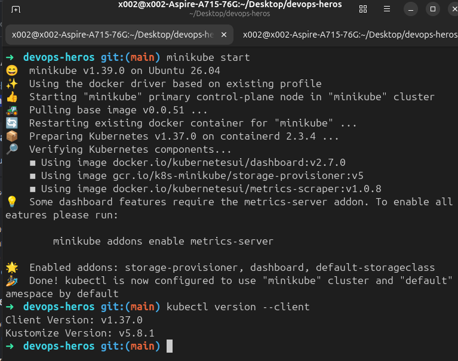
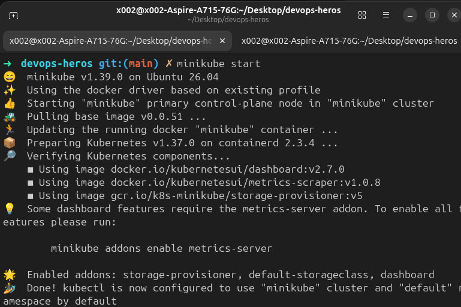
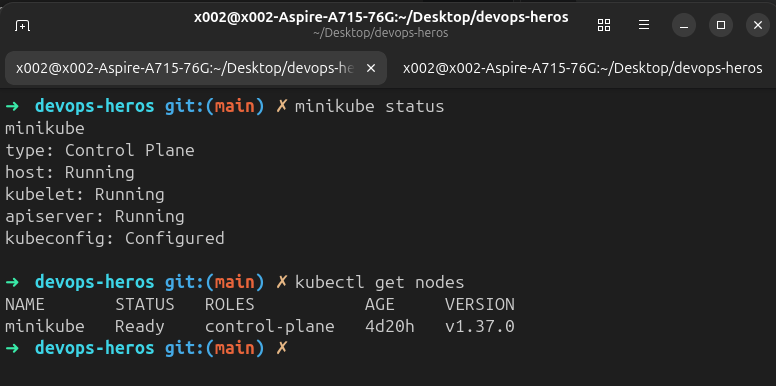
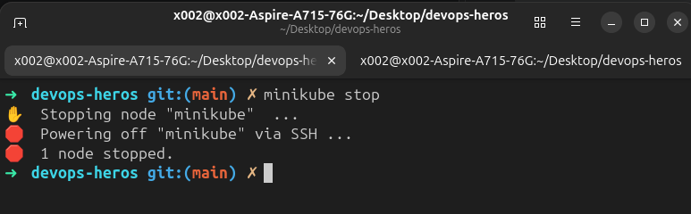
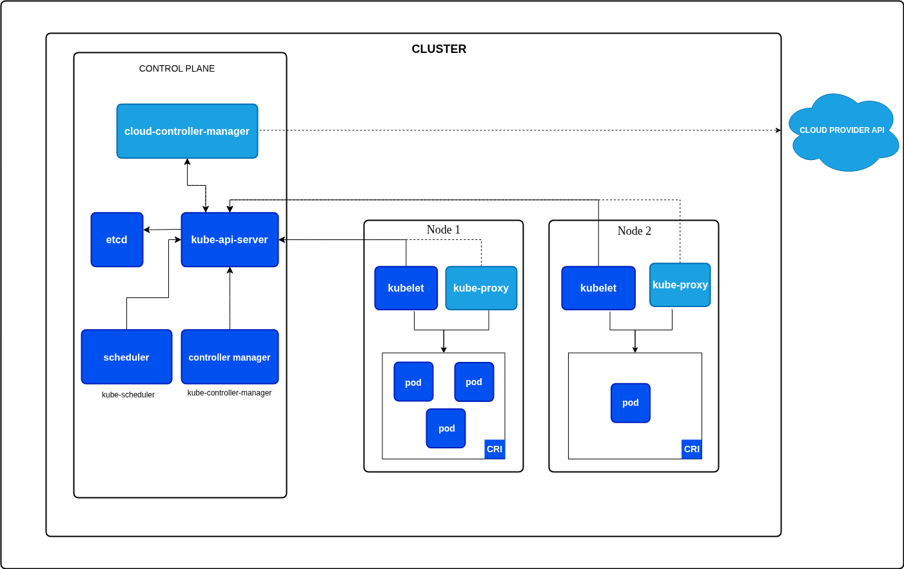

# Session 9: Kubernetes Fundamentals and Cluster Architecture

**Author:** Aashu Kumar  
**Course:** SST DevOps and Cloud [SWE]  
**Session:** 09 - Kubernetes Fundamentals  
**Repository:** devops-heros / session9-k8s

## Task 1: Minikube and kubectl Installation Verification

Verify that Minikube and the Kubernetes CLI (`kubectl`) are installed.

**Commands:**

```bash
minikube version
kubectl version --client
```

**Terminal output:**

```text
Paste the output from your terminal here.
```

**Screenshot:**



## Task 2: Minikube Cluster Lifecycle

Start the local Kubernetes cluster, verify its components, and stop it cleanly.

### 2.1 Start the cluster

**Command:**

```bash
minikube start
```

**Terminal output:**

```text
Paste the output from your terminal here.
```

**Screenshot:**



### 2.2 Check cluster status

**Commands:**

```bash
minikube status
kubectl get nodes
```

**Terminal output:**

```text
Paste the output from your terminal here.
```

**Screenshots:**




### 2.3 Stop the cluster

**Command:**

```bash
minikube stop
```

**Terminal output:**

```text
Paste the output from your terminal here.
```

**Screenshot:**



## Task 3: Kubernetes Architecture and Core Components

Read the [official Kubernetes Architecture documentation](https://kubernetes.io/docs/concepts/architecture/) and document how the control plane and worker node components interact.

**Reference:**

```text
https://kubernetes.io/docs/concepts/architecture/
```

**Terminal output:**

```text
No terminal output. This task is based on reading and documenting the official documentation.
```

**Screenshot:**



### Control Plane (Master)

The control plane manages the overall state of the Kubernetes cluster. Its main components are:

- **kube-apiserver:** Exposes the Kubernetes API and is the main entry point for `kubectl`, clients, and other cluster components.
- **etcd:** Stores the cluster configuration and current state as highly available key-value data.
- **kube-scheduler:** Selects a suitable worker node for newly created Pods by considering resource availability and scheduling requirements.
- **kube-controller-manager:** Runs controllers that continually compare the desired state with the actual state and make changes to reconcile them.
- **cloud-controller-manager:** Connects the cluster to cloud-provider APIs when Kubernetes is running in a cloud environment.

### Worker Node

A worker node runs application workloads in Pods. Its main components are:

- **kubelet:** Ensures that the containers described by Pod specifications are running and healthy on the node.
- **kube-proxy:** Maintains network rules that allow traffic to reach Services and their backend Pods.
- **Container runtime:** Pulls images and runs containers, for example containerd or CRI-O.

### How the Components Interact

Users submit desired state through `kubectl` to the kube-apiserver. The API server stores that state in etcd. The scheduler assigns unscheduled Pods to worker nodes, while controllers watch the cluster and create or update resources to match the desired state. The kubelet on each selected node receives Pod instructions through the API server and asks the container runtime to run the containers. kube-proxy helps route Service traffic to the appropriate Pods. Status updates flow back through the kubelet and API server into the cluster state.

## Submission

Submit the raw GitHub link to this file in the section Google Form:

```text
https://github.com/Nency-Ravaliya/devops-heros/blob/main/session9-k8s/README.md
```

## Screenshot Naming Checklist

Place the remaining screenshots in `session9-k8s/screenshots/` with these exact names:

| Screenshot | Filename |
| --- | --- |
| `minikube start` | `02-minikube-start.png` |
| `minikube status` | `03-minikube-status.png` |
| `kubectl get nodes` | `04-kubectl-get-nodes.png` |
| `minikube stop` | `05-minikube-stop.png` |
| Architecture documentation | `06-kubernetes-architecture.png` |